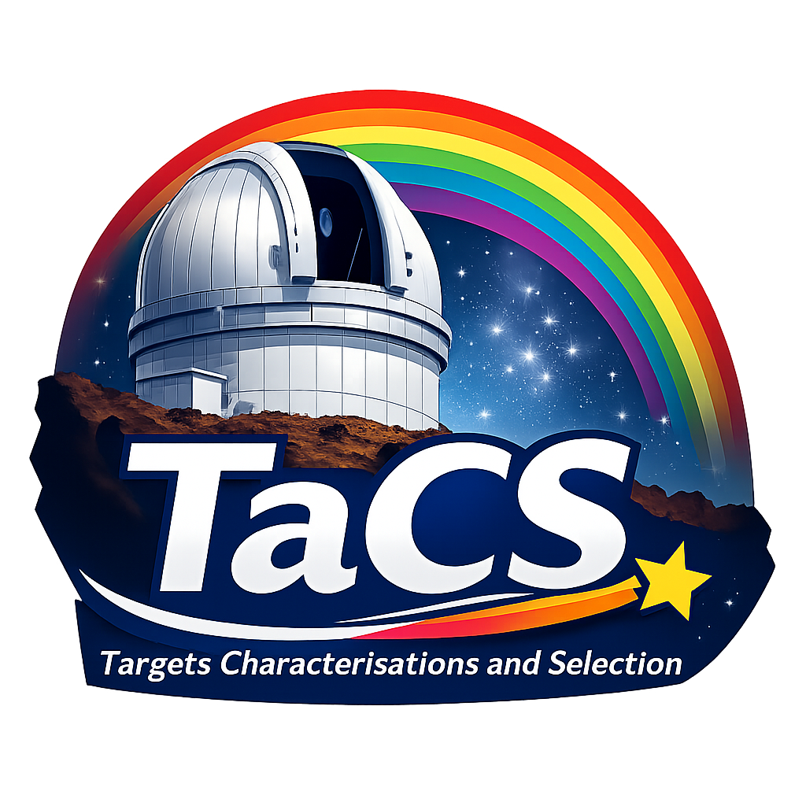

# TaCS (Targets Characterisation and Selection) for the Terra Hunting Experiment (v1.43)

<p align="center">
  
</p>

# Contact Me

If you have any problem, please contact me at:

michael.cretignier@physics.ox.ac.uk

# Installation

Download the directory and try to run THE_TCS_main.py with your own Python installation.
If bug, install a Python environment:

# [Mac M4 Chip] Python environment (Conda install) (Python 3.12.5)

```
conda create -n tcs -c conda-forge python=3.12.5 numpy=1.26.4 pandas=2.3.2 scipy=1.16.2 astropy=7.1.0 matplotlib=3.10.6 ipython=9.5.0 colorama=0.4.4 pyqt=5.15 -y 
```

# [Mac M2 Chip] Python environment (Conda forge install) (Python 3.10)

```
conda create -n tcs -c conda-forge python=3.10.0 numpy=1.23.5 pandas=1.4.1 scipy=1.8 astropy=5.2.2 matplotlib=3.5 ipython=8.11.0 colorama=0.4.4 pyqt=5.15 -y
```

# [Mac Intel Chip] Python environment (Conda install) (Python 3.8.8)

```
conda create -n tcs python=3.8.8 \
conda activate tcs \
pip install -r requirements_3.8.8.txt
```

# Python environment (Venv install)

[TERMINAL] python3 -m venv tcs \
[TERMINAL] source tcs/bin/activate \
[TERMINAL] pip install --upgrade pip \
[TERMINAL] pip install -r requirements_3.8.8.txt

# Tutorial (run the main.py in a iPython shell)

[TERMINAL] conda activate env tcs \
[TERMINAL] cd ../TACS/Python \
[TERMINAL] ipython \
[IPYTHON] run THE_TCS_main.py

# References

GR8 table is coming from Freckelton et al. +25 (2025yCat..75401786F)

The computation of the RV budget is made using:
 
1) ARVE (Al Moulla + 25, 2025A&A...701A.266A)
2) GP (O'Sullivan et al. in prep.)
3) ExTEMPO (https://github.com/BRajkumar041992/ExTEMPO)

# Uninstall

[TERMINAL] conda remove --name tcs --all
